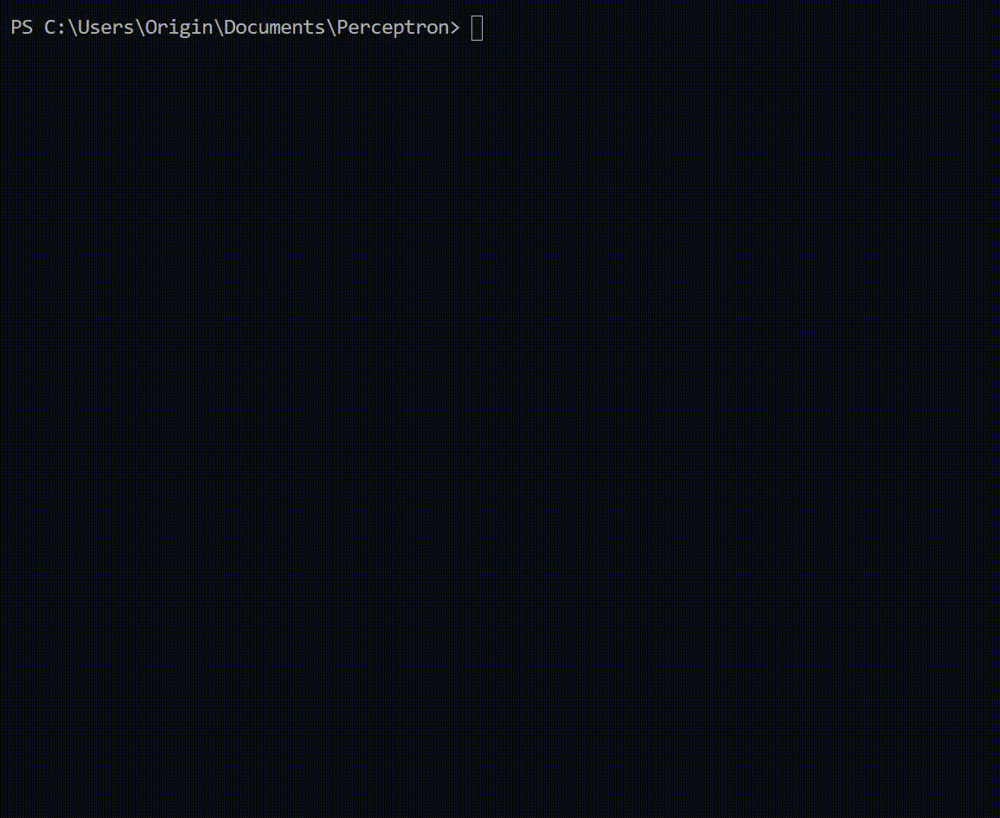

# This is a simple implementation of the perceptron=)
## Build 
### run shell 
### using generator "Visual Studio 16 2019"

### or run 
    cmake -G "Visual Studio 16 2019" 
    cmake --build .
You can using another generator for C++, for example "Ninja"

